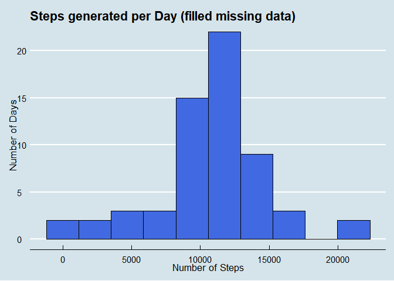

The goal is to create a reproducible analysis of a certain data set. 
Specifically, we will explore and ask questions to gain an insight about personal activity data generated by an anonymous individual from the months of October and November, 2012. To obtain the data, simply clone the repository. 

## **Loading and preprocessing the data**


```r
> # Load necessary packages
> library(tidyverse)
> library(lubridate)
> library(ggthemes)
> 
> # Reading a zip file is pretty straightforward
> activity_data <- read_csv("activity.zip")
> 
> # Gettin a sense of the data
> glimpse(activity_data)
```

```
Rows: 17,568
Columns: 3
$ steps    <dbl> NA, NA, NA, NA, NA, NA, NA, NA, NA, NA, NA, NA, NA, NA, NA...
$ date     <date> 2012-10-01, 2012-10-01, 2012-10-01, 2012-10-01, 2012-10-0...
$ interval <dbl> 0, 5, 10, 15, 20, 25, 30, 35, 40, 45, 50, 55, 100, 105, 11...
```

Apparently the data has **17568** rows and **3** columns. We can also see the corresponding data types for each column. The following table describes each variable:

|**Column name** | **Description**|
|:---:|:---:|
|**steps**| number of steps taken per 5-minute interval 
|**date**| period on which the measurement was taken in YYYY-MM-DD format|
|**interval**| identifier for the 5-minute interval in which measurement was taken|

Looking at the first ten rows, 


```r
> head(activity_data, n = 10)
```

```
# A tibble: 10 x 3
   steps date       interval
   <dbl> <date>        <dbl>
 1    NA 2012-10-01        0
 2    NA 2012-10-01        5
 3    NA 2012-10-01       10
 4    NA 2012-10-01       15
 5    NA 2012-10-01       20
 6    NA 2012-10-01       25
 7    NA 2012-10-01       30
 8    NA 2012-10-01       35
 9    NA 2012-10-01       40
10    NA 2012-10-01       45
```

Notice we have `NA` values. These are the missing values
of the data. We'll delve into how to fill these values later. For now, let's answer
some questions.

## **What is mean total number of steps taken per day?**

Excluding the rows that have missing values. First, let's create a table which
summarizes the total steps taken per day.


```r
> df <- activity_data %>%
+         # remove NA's first then
+         drop_na(steps) %>%
+         # aggregate by date
+         group_by(date) %>%
+         # calculate the sum of steps per group
+         summarise(steps_per_day = sum(steps))
> df 
```

```
# A tibble: 53 x 2
   date       steps_per_day
   <date>             <dbl>
 1 2012-10-02           126
 2 2012-10-03         11352
 3 2012-10-04         12116
 4 2012-10-05         13294
 5 2012-10-06         15420
 6 2012-10-07         11015
 7 2012-10-09         12811
 8 2012-10-10          9900
 9 2012-10-11         10304
10 2012-10-12         17382
# ... with 43 more rows
```

We can also visually inspect the table to get an idea of how the number of steps taken each day is distributed. 


```r
> df %>% ggplot(aes(steps_per_day)) +
+         geom_histogram(bins = 10, color = "black", fill = "royalblue") +
+         labs(x = "Number of Steps", 
+              y = "Number of Days",
+              title = "Steps generated per Day (excluding missing data)") + 
+         theme_economist() + 
+         theme(axis.title = element_text(size = 13))
```

<!-- -->


From the histogram, We can infer that the mean is roughly around 10,000 steps.
Analytically, the total mean number of steps taken each day is


```r
> mean(df$steps_per_day) 
```

```
[1] 10766.19
```

and the median at


```r
> median(df$steps_per_day)
```

```
[1] 10765
```

## **What is the average daily activity pattern?**

Let's create another table summarizing daily activity. Specifically, let's look at the average steps taken on each interval across all days. 


```r
> df <- activity_data %>%
+         # remove NA's first then
+         drop_na() %>%
+         # aggregate by interval
+         group_by(interval) %>%
+         # compute for the mean step per interval
+         summarize(average_steps = mean(steps))
> df
```

```
# A tibble: 288 x 2
   interval average_steps
      <dbl>         <dbl>
 1        0        1.72  
 2        5        0.340 
 3       10        0.132 
 4       15        0.151 
 5       20        0.0755
 6       25        2.09  
 7       30        0.528 
 8       35        0.868 
 9       40        0     
10       45        1.47  
# ... with 278 more rows
```

We can generate a time-series plot to see how the average number of steps
on each interval per day varies. 


```r
> df %>% ggplot(aes(interval, average_steps)) +
+         geom_line(size = 1.2) +
+         labs(x = "Interval", 
+              y = "Number of Steps", 
+              title = "Average number of Steps per Interval" ) +
+         theme_economist() + 
+         theme(axis.title = element_text(size = 13))
```

<!-- -->


Looking at the graph, we can say that there is a 5-minute interval or time of the day at which the anonymous individual took more than 200 steps on the average. 

The exact interval along with the maximum number of steps taken on average is at


```r
> df[which.max(df$average_steps),]
```

```
# A tibble: 1 x 2
  interval average_steps
     <dbl>         <dbl>
1      835          206.
```

That's **206 steps** made on the **835th interval** on average.

 

## **Imputing missing values**

Now, we delve at `NA`'s. As said before, these are missing values. Since we don't
know what to think about these values, we excluded it in earlier computations. This time, let's try to fill them in and see how they affect previously computed summaries.
First, let's check the total number of missing values


```r
> sum(is.na(activity_data))
```

```
[1] 2304
```

So there's a total of **2304** `NA`'s. These values exist only on column/s


```r
> map(activity_data, ~sum(is.na(.)))
```

```
$steps
[1] 2304

$date
[1] 0

$interval
[1] 0
```

Indeed, only the **`steps`** column contains **2304** missing data. There's a lot of methods for imputing missing values. But for the purpose of this assignment, we'll make it simple and impute these by using the mean of the interval they belong to.

Recall that we can get these values from the table above.


```r
> df
```

```
# A tibble: 288 x 2
   interval average_steps
      <dbl>         <dbl>
 1        0        1.72  
 2        5        0.340 
 3       10        0.132 
 4       15        0.151 
 5       20        0.0755
 6       25        2.09  
 7       30        0.528 
 8       35        0.868 
 9       40        0     
10       45        1.47  
# ... with 278 more rows
```

We'll just have to round the average steps on each interval to whole numbers.


```r
> df <- df %>%
+         mutate(average_steps = round(average_steps))
> df
```

```
# A tibble: 288 x 2
   interval average_steps
      <dbl>         <dbl>
 1        0             2
 2        5             0
 3       10             0
 4       15             0
 5       20             0
 6       25             2
 7       30             1
 8       35             1
 9       40             0
10       45             1
# ... with 278 more rows
```

Now, to fill the `NA`'s we'll have to merge this **`df`** dataframe with our original table, **`activity_data`**.


```r
> df_nona <- activity_data %>%
+         # merge two table by the interval column 
+         left_join(df, by = c("interval" = "interval"))
> df_nona
```

```
# A tibble: 17,568 x 4
   steps date       interval average_steps
   <dbl> <date>        <dbl>         <dbl>
 1    NA 2012-10-01        0             2
 2    NA 2012-10-01        5             0
 3    NA 2012-10-01       10             0
 4    NA 2012-10-01       15             0
 5    NA 2012-10-01       20             0
 6    NA 2012-10-01       25             2
 7    NA 2012-10-01       30             1
 8    NA 2012-10-01       35             1
 9    NA 2012-10-01       40             0
10    NA 2012-10-01       45             1
# ... with 17,558 more rows
```

We can see now the column **`average_steps`** from **`df`** table. We'll alter the **`steps`** column using this column.


```r
> df_nona <- df_nona %>%
+         # if steps is NA, fill value from average_steps, otherwise do nothing
+         mutate(steps = ifelse(is.na(steps), average_steps, steps)) %>%
+         # selecting all columns except average_steps
+         select(-4)
> df_nona
```

```
# A tibble: 17,568 x 3
   steps date       interval
   <dbl> <date>        <dbl>
 1     2 2012-10-01        0
 2     0 2012-10-01        5
 3     0 2012-10-01       10
 4     0 2012-10-01       15
 5     0 2012-10-01       20
 6     2 2012-10-01       25
 7     1 2012-10-01       30
 8     1 2012-10-01       35
 9     0 2012-10-01       40
10     1 2012-10-01       45
# ... with 17,558 more rows
```

Let's check the number of `NA`'s now.


```r
> sum(is.na(df_nona))
```

```
[1] 0
```

Awesome! Let's recreate the histogram from before. 


```r
> # create a table which is 
> df_nona_hist <- df_nona %>% 
+         # aggregated by date
+         group_by(date) %>%
+         # and has the total steps per date
+         summarize(steps_per_day = sum(steps)) 
> 
> # Generate histogram        
> df_nona_hist %>% ggplot(aes(steps_per_day)) +
+                 geom_histogram(bins = 10, color = "black", fill = "royalblue") +
+                 labs(x = "Number of Steps", 
+                      y = "Number of Days",
+                      title = "Steps generated per Day (filled missing data)") + 
+                 theme_economist() + 
+                 theme(axis.title = element_text(size = 13))
```

<!-- -->


Unsurprisingly, the shape of the distribution is still the same (since we just add the means of each interval) but we have more observations now towards the middle.  

Analytically, the mean of the new dataframe is


```r
> mean(df_nona_hist$steps_per_day)
```

```
[1] 10765.64
```

with median at


```r
> median(df_nona_hist$steps_per_day)
```

```
[1] 10762
```


## **Are there differences in activity patterns between weekdays and weekends?**

To answer this question, we'll first create a new variable/column which indicates if a given observation is a `"weekday"` or a `"weekend"`. We'll use **`wday()`** function from the **`lubridate`** package which gives the numeric value for
a given day of the week and **`ifelse`** function to check if a given observation is within a certain range. If it is within `1:5` with `1` representing `Monday`, then the function outputs `"weekday"`, `"weekend"` otherwise.


```r
> df_nona_wday <- df_nona %>%
+         mutate(day_of_the_week =
+           ifelse(wday(date, week_start = 1) %in% 1:5,"weekday","weekend")) %>%
+         group_by(interval, day_of_the_week) %>%
+         summarize(average_steps = mean(steps))
> df_nona_wday
```

```
# A tibble: 576 x 3
# Groups:   interval [288]
   interval day_of_the_week average_steps
      <dbl> <chr>                   <dbl>
 1        0 weekday                2.29  
 2        0 weekend                0.25  
 3        5 weekday                0.4   
 4        5 weekend                0     
 5       10 weekday                0.156 
 6       10 weekend                0     
 7       15 weekday                0.178 
 8       15 weekend                0     
 9       20 weekday                0.0889
10       20 weekend                0     
# ... with 566 more rows
```

Visually, we can show the difference between the number of steps taken on weekdays or weekends. 


```r
> df_nona_wday %>%
+         ggplot(aes(interval,average_steps, color = day_of_the_week)) + 
+           geom_line(size = 1.2) + 
+           labs(x = "Interval",
+                y = "Number of Steps",
+                title = "Steps generated on Weekdays vs Weekends") +
+           facet_grid(day_of_the_week ~.) +
+           theme_economist() +
+           theme(legend.position = "none", 
+                 axis.title = element_text(size = 12),
+                 strip.text.y = element_text(size = 12, face = "bold.italic"))
```

<!-- -->


Interestingly, weekends generally have more spikes than weekdays. That is, there are more steps made on certain intervals/time of the day on weekends than on weekdays by the anonymous individual.
